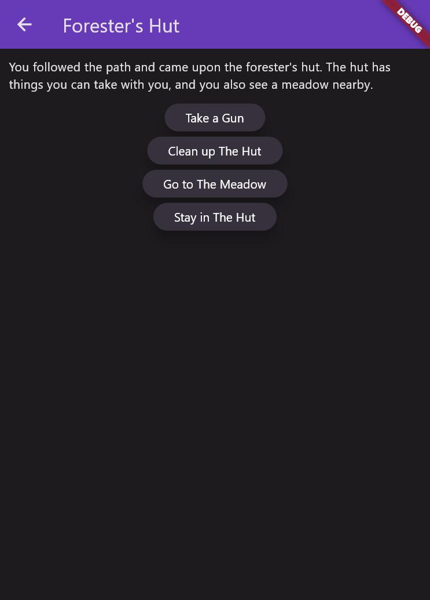

# 

**Quester-Flutter** is a frontend for [Quester](https://github.com/artyom-mameev/quester) written in Dart/Flutter.

    

## Table of Contents

[How it works](#how-it-works)  
[Features](#features)  
[Architecture](#architecture)  
[Code style](#style)  
[TODO](#todo)  
[License](#license)

<a name="how-it-works"/>

## How it works

- [http](https://pub.dev/packages/http) for making HTTP requests;
- [intl](https://pub.dev/packages/intl) for date formatting;
- [infinite_scroll_pagination](https://pub.dev/packages/infinite_scroll_pagination) for implementing infinite scrolling;
- [country_flags](https://pub.dev/packages/country_flags) for country flag icons.

<a name="features"/>

## Features

- A list of text games with all the basic information and infinite scrolling;
- A full-featured text game player.

<a name="architecture"/>

## Architecture

- A clean package structure, with classes organized by purpose, area of responsibility, and level of abstraction;
- A focus on generally accepted good coding principles and design patterns.

<a name="style"/>

## Code style

- Focus to write simple and readable code;
- Simple and meaningful names of classes, methods and variables, separation of different aspects of functionality to separate methods;
- Сomplex points accompanied by comments;
- Separation of complex code constructs into several primitive parts for better understanding, the code is also separated by purpose;
- Limiting the number of characters by line width for better readability;
- Avoiding "spaghetti code" (nested ifs).

<a name="todo"/>

## TODO

- Write documentation;
- Write tests;
- Implement registration and login;
- Implement game builder;
- Implement comments;
- Implement voting;
- Implement different modes of sorting;
- Implement user profile and user settings.

<a name="license"/>

## License

Copyright ©2022 Artyom Mameev.
Licensed under the [MIT License](https://opensource.org/licenses/MIT).